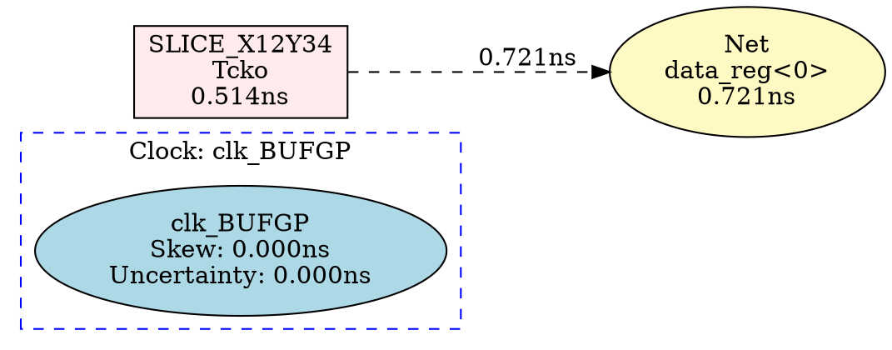

# Enhanced Timing Graph Visualization - New Features! 🎉

## What's New

### 1. **Complete Path Visualization** 🛤️
The timing graph now shows **ALL resources** that the timing path goes through, not just source and destination!

#### Before:
```
[data_reg<0>] ----10.234ns----> [output_reg<7>]
```

#### After:
```
[Clock] --> [SLICE_X12Y34] --> [Net] --> [SLICE_X15Y35] --> [Net] --> 
[SLICE_X15Y36] --> [Net] --> [SLICE_X15Y37] --> ... --> [output_reg<7>]
```

### 2. **Clock Path Information** 🕐
Clock paths are now prominently displayed with:
- Source clock name
- Destination clock name  
- Clock skew
- Clock uncertainty

### 3. **Detailed Resource Information** 📍
Each node in the graph shows:
- **Location**: Physical location (e.g., SLICE_X12Y34.AQ)
- **Delay Type**: Type of delay (e.g., Tcko, Tilo, net)
- **Delay Value**: Precise delay in nanoseconds
- **Resource Name**: Logical resource name

### 4. **Visual Differentiation** 🎨
Different element types have different appearances:
- **Logic Elements**: Rectangular boxes (red for failed)
- **Net Elements**: Ellipses (yellow background)
- **Clock Elements**: Diamonds (blue background)

## Implementation Details

### Enhanced Data Types

#### New `ClockPathInfo` Interface
```typescript
interface ClockPathInfo {
    sourceClock: string;
    destinationClock: string;
    clockSkew: number;
    uncertainty: number;
}
```

#### Enhanced `PathElement` Interface
```typescript
interface PathElement {
    type: 'logic' | 'net' | 'clock';
    name: string;
    delay: number;
    location?: string;          // NEW: SLICE_X12Y34.AQ
    delayType?: string;         // NEW: Tcko, Tilo, net
    resource?: string;          // NEW: Physical resource
}
```

### Parser Enhancements

The parser now extracts:

1. **Detailed Path Elements**
   ```
   Location             Delay type         Delay(ns)  Physical Resource
   SLICE_X12Y34.AQ      Tcko                  0.514   data_reg<0>
   ```
   Parsed into structured PathElement objects

2. **Clock Information**
   ```
   Source Clock:         clk_BUFGP rising at 0.000ns
   Destination Clock:    clk_BUFGP rising at 10.000ns
   Clock Path Skew:      0.000ns
   Clock Uncertainty:    0.000ns
   ```

3. **Resource Hierarchy**
   - Physical location (SLICE_X12Y34.AQ)
   - Logical resource (data_reg_0)
   - Signal name (data_reg<0>)

### Graph Visualization

#### Graphviz DOT Generation
The graph now generates a detailed DOT representation:



#### Visual Styling
- **Failed paths**: Red borders, pink background (#ffebee)
- **Passed paths**: Green borders, light green background (#e8f5e9)
- **Net elements**: Yellow background (#fff9c4), dashed edges
- **Clock elements**: Light blue background (#e1f5fe), diamond shape
- **Logic elements**: White/pink background, solid edges

### Hover Provider Enhancements

The hover tooltip now shows:

```markdown
### ❌ Timing Path

**Source:** data_reg<0> (FF)
**Destination:** output_reg<7> (FF)
**Slack:** -2.234 ns (FAILED)
**Requirement:** 8.000 ns
**Total Delay:** 10.234 ns

---

**Clock Information:**
- Source Clock: clk_BUFGP
- Destination Clock: clk_BUFGP
- Clock Skew: 0.000 ns
- Uncertainty: 0.000 ns

---

**Path Details (14 elements):**
- **Logic:** 2.205 ns (7 elements)
- **Net:** 8.029 ns (7 elements)

**Path Preview:**
1. 🔲 SLICE_X12Y34.AQ Tcko: 0.514 ns
2. 🔗 SLICE_X15Y35.A3 net (fanout=4): 0.721 ns
3. 🔲 SLICE_X15Y35.COUT Tilo: 0.124 ns
4. 🔗 SLICE_X15Y36.CIN net (fanout=1): 0.000 ns
5. 🔲 SLICE_X15Y36.COUT Tilo: 0.034 ns

... and 9 more elements
```

## Testing the New Features

### 1. Open Extension Development Host
```bash
cd C:\Users\chen\xilinx-timing-analyzer
code .
# Press F5
```

### 2. Open Test File
In the new window:
```
File → Open File → test-sample.twr
```

### 3. View Enhanced Graph
- Click the preview button (top-right)
- OR Right-click → "Open Timing Graph to the Side"

### 4. What You Should See

#### In the Graph:
- **Clock node** (blue diamond) at the start
- **Multiple SLICE nodes** showing each logic element
- **Net connections** between slices (yellow ellipses with dashed lines)
- **Delay labels** on each edge
- **Complete path** from source flip-flop through all logic to destination

#### Example Graph Flow:
```
[Clock: clk_BUFGP] 
    ↓
[SLICE_X12Y34: Tcko 0.514ns]
    ↓ (dashed line - net 0.721ns)
[Net: data_reg<0>]
    ↓
[SLICE_X15Y35: Tilo 0.124ns]
    ↓ (dashed line - net 0.000ns)
[Net: Mmux_temp1]
    ↓
[SLICE_X15Y36: Tilo 0.034ns]
    ↓
... (continues through all elements)
    ↓
[SLICE_X20Y42: Tas 0.309ns - output_reg<7>]
```

### 5. Hover Over Path Elements
Hover anywhere in the timing path section to see:
- Complete clock information
- Logic vs. Net delay breakdown
- Preview of first 5 path elements
- Total element count

## Key Improvements

### Before vs. After Comparison

| Aspect | Before | After |
|--------|--------|-------|
| **Nodes Shown** | 2 (source, dest) | 14+ (all resources) |
| **Clock Info** | ❌ Not shown | ✅ Prominent display |
| **Resource Details** | ❌ Missing | ✅ Location, type, delay |
| **Net Delays** | ❌ Not visible | ✅ Separate nodes |
| **Visual Clarity** | Basic | Color-coded by type |
| **Hover Info** | Basic | Comprehensive |

### Statistics Shown

For each path, the graph now displays:
1. **Total delay** (sum of all elements)
2. **Logic delay** (sum of logic elements only)
3. **Net delay** (sum of net elements only)
4. **Element count** (total number of path elements)
5. **Clock parameters** (skew, uncertainty)

## Example Output

### Sample Path in Graph:
```
Path: data_reg<0> -> output_reg<7> (Slack: -2.234ns)
Clock: clk_BUFGP (Skew: 0.000ns, Uncertainty: 0.000ns)

Elements:
1. SLICE_X12Y34.AQ [Tcko] → 0.514ns
2. Net [fanout=4] → 0.721ns
3. SLICE_X15Y35.COUT [Tilo] → 0.124ns
4. Net [fanout=1] → 0.000ns
5. SLICE_X15Y36.COUT [Tilo] → 0.034ns
... (9 more elements)

Summary: Total=10.234ns, Logic=2.205ns (21.6%), Net=8.029ns (78.4%)
```

## Code Changes Summary

### Modified Files:
1. **src/types/timing.ts**
   - Added `ClockPathInfo` interface
   - Enhanced `PathElement` with location, delayType, resource

2. **src/parser/twrParser.ts**
   - Complete rewrite of path extraction logic
   - Parses detailed timing report tables
   - Extracts clock information
   - Builds structured path element list

3. **src/visualization/graphPanel.ts**
   - Generates nodes for each path element
   - Adds clock path subgraph
   - Color-codes by element type
   - Shows delay on edges

4. **src/providers/hoverProvider.ts**
   - Displays clock information
   - Shows logic/net/clock breakdown
   - Previews first 5 elements
   - Element count statistics

### Lines of Code:
- **Parser**: ~150 lines (was ~50)
- **Graph Generator**: ~100 lines (was ~25)
- **Hover Provider**: ~60 lines (was ~30)

## Future Enhancements

### Potential Next Steps:
1. **Interactive Nodes** - Click to jump to line in .twr file
2. **Filtering** - Show/hide net elements, filter by slack threshold
3. **Path Comparison** - Compare multiple failed paths side-by-side
4. **Export** - Save graph as PNG/SVG
5. **Hierarchical View** - Group elements by FPGA regions
6. **Timing Histogram** - Distribution of delays across path
7. **Critical Chain** - Highlight slowest elements

## Summary

✅ **Complete path visualization** - All slices, nets, and resources shown  
✅ **Clock path display** - Prominent clock information at graph start  
✅ **Detailed resource info** - Location, delay type, physical resource  
✅ **Visual differentiation** - Color-coded by type (logic/net/clock)  
✅ **Enhanced hover tooltips** - Comprehensive timing breakdown  
✅ **Compiled successfully** - Ready to test!  

**Press F5 and open test-sample.twr to see the enhanced visualization!** 🚀
